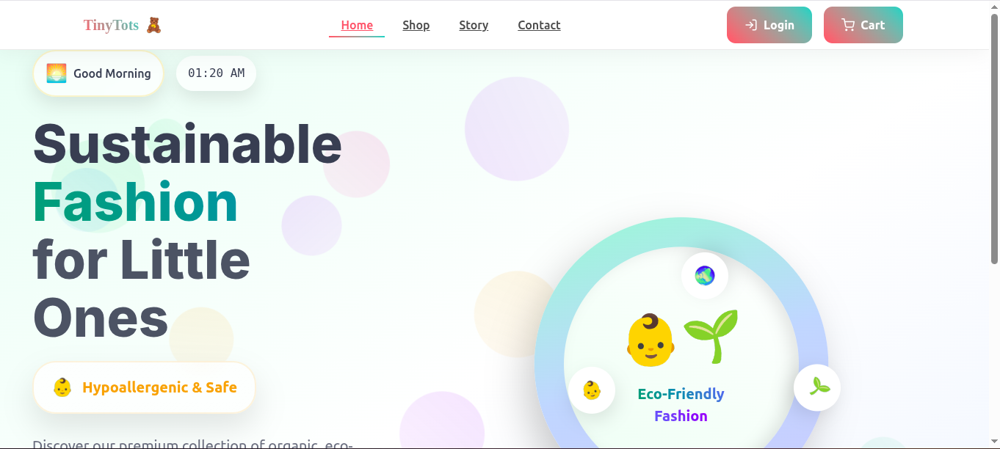
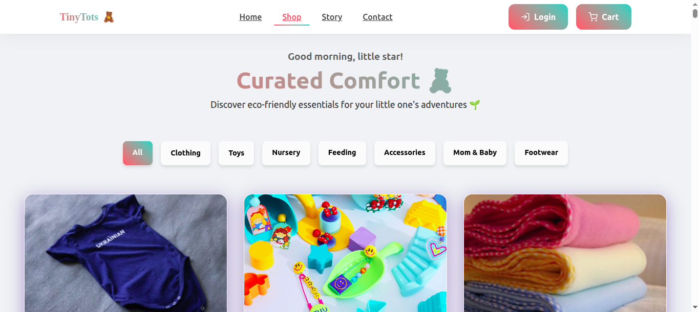
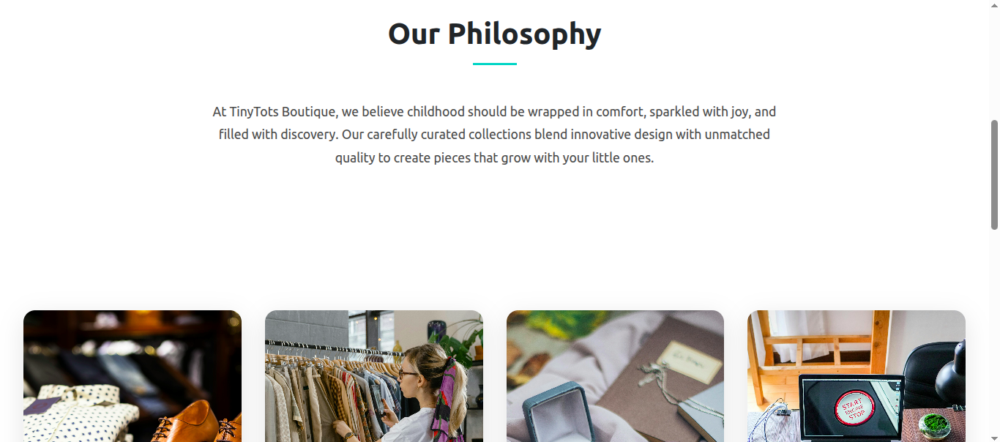

# TinyTots Boutique 👶


A modern, responsive e-commerce platform specializing in eco-friendly children's and women's fashion. Built with React and featuring smooth animations, this platform offers a delightful shopping experience with real-time interactions and intuitive navigation.

## 🖼️ Screenshots

| Feature | Preview |
|---------|---------|
| **Home Page** |  |
| **Products Page** |  |
| **Navigation** |  |

## ✨ Features

- 🌟 **Immersive Experience**
  - Dynamic hero section with time-based greetings
  - Smooth page transitions and micro-interactions
  - Animated loading states for better perceived performance

- 🛍️ **E-commerce Functionality**
  - Product browsing with filtering options
  - Shopping cart management
  - Responsive design across all devices

- 🎨 **UI/UX Highlights**
  - Modern, clean interface with gradient themes
  - Intuitive navigation and clear CTAs
  - Accessible and keyboard-navigable components

- 🚀 **Technical Features**
  - State management with Redux Toolkit
  - Responsive layout with mobile-first approach
  - Optimized performance with code splitting
  - Live chat support integration

## 🚀 Getting Started

### Prerequisites
- Node.js (v14 or later)
- npm (v6 or later) or Yarn

### Installation

1. **Clone the repository**
   ```bash
   git clone https://github.com/edogola4/tinytots-boutique.git
   cd tinytots-boutique
   ```

2. **Install dependencies**
   ```bash
   npm install
   # or
   yarn install
   ```

3. **Start the development server**
   ```bash
   npm start
   # or
   yarn start
   ```

4. **Open in browser**
   The application will be available at [http://localhost:3000](http://localhost:3000)

## 🛠️ Technologies Used

| Category | Technologies |
|----------|--------------|
| **Core** | React 18, React Router 6 |
| **Styling** | styled-components, CSS3 |
| **State Management** | Redux Toolkit |
| **Animations** | Framer Motion |
| **UI Components** | React Icons, React Hot Toast |
| **Analytics** | Vercel Analytics |
| **Chat** | Tawk.to |

## 📁 Project Structure

```
tinytots-boutique/
├── public/                 # Static files
├── src/
│   ├── assets/            # Images, fonts, and other static assets
│   ├── components/        # Reusable UI components
│   │   ├── common/       # Shared components
│   │   ├── layout/       # Layout components
│   │   └── ui/           # Basic UI elements
│   ├── pages/            # Page components
│   ├── redux/            # Redux store and slices
│   ├── styles/           # Global styles and theme
│   ├── utils/            # Utility functions
│   ├── App.jsx           # Main application component
│   └── index.js          # Application entry point
├── .gitignore
├── package.json
└── README.md
```

## 🔧 Configuration

### Environment Variables
Create a `.env` file in the root directory and add the following:

```env
REACT_APP_TAWK_TO_WIDGET_ID=your_tawk_to_widget_id
```

### API Integration
This project uses the [Fake Store API](https://fakestoreapi.com/) for demonstration purposes. For production, replace with your own API endpoints in the API service files.

## 🤝 Contributing

We welcome contributions! Here's how you can help:

1. Fork the repository
2. Create a feature branch: `git checkout -b feature/your-feature-name`
3. Commit your changes: `git commit -m 'Add some amazing feature'`
4. Push to the branch: `git push origin feature/your-feature-name`
5. Open a pull request

Please make sure to follow the existing code style and add tests if applicable.

## 📄 License

This project is licensed under the MIT License - see the [LICENSE](LICENSE) file for details.

## 🙏 Acknowledgments

- [Fake Store API](https://fakestoreapi.com/) for providing mock product data
- [React Community](https://reactjs.org/community/support.html) for the amazing ecosystem
- [Framer Motion](https://www.framer.com/motion/) for the smooth animations
- [Tawk.to](https://www.tawk.to/) for the live chat functionality
- All contributors who have helped improve this project

---

<div align="center">
  Made with ❤️ by brandon | 🌟 Star this project on [GitHub](https://github.com/edogola4/tinytots-boutique)
</div>